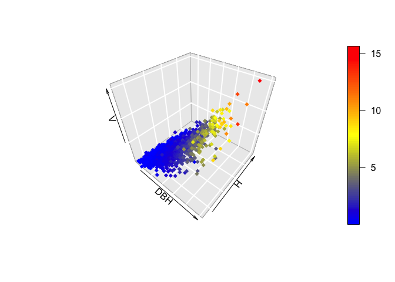

Volumetric Equations
================
Bruno Hérault
3/29/2018

-   [problem statement](#problem-statement)
    -   [data uploading](#data-uploading)
    -   [data visualization](#data-visualization)
-   [Testing alternative models](#testing-alternative-models)
    -   [Hohenald–Krenn (Finger, 1992)](#hohenaldkrenn-finger-1992)
    -   [Husch (Finger, 1992)](#husch-finger-1992)
    -   [Spurr (1952)](#spurr-1952)
    -   [Schumacher-Hall (1952)](#schumacher-hall-1952)
-   [testing for a forest type effect](#testing-for-a-forest-type-effect)
    -   [on theta\_0](#on-theta_0)
    -   [on theta\_1](#on-theta_1)
    -   [on theta\_2](#on-theta_2)
-   [Conclusions](#conclusions)

problem statement
=================

From Ervan

*Dis, je bosse avec un Brésilien sur l'estimation de volume au Para et on tente de développer des modèles allométriques pour différents types forestiers. J'aimerais développer un modèle général en regroupant les 3 types forestiers et toutes les données. Ensuite, j'aimerais tester si il y a un effet type forester sur l'estimation du volume. Je fais cela: lmer(volume ~ log(DBH) + log(Htronc) | type.forestier) *

data uploading
--------------

``` r
flota<-read.csv("FLOTA_FT.csv")
summary(flota)
```

    ##      FT           Pont            DAPm             DAPcm        
    ##  Low  :855   Min.   : 1.00   Min.   :0.05761   Min.   :  5.761  
    ##  Sub  :228   1st Qu.:13.00   1st Qu.:0.23500   1st Qu.: 23.500  
    ##  Trans:181   Median :21.00   Median :0.34750   Median : 34.750  
    ##              Mean   :18.48   Mean   :0.38546   Mean   : 38.546  
    ##              3rd Qu.:27.00   3rd Qu.:0.49412   3rd Qu.: 49.413  
    ##              Max.   :30.00   Max.   :1.23400   Max.   :123.400  
    ##       HCm             HTm              D0               D1        
    ##  Min.   : 2.40   Min.   : 3.00   Min.   :0.0730   Min.   :0.0710  
    ##  1st Qu.: 7.50   1st Qu.: 9.90   1st Qu.:0.2700   1st Qu.:0.2417  
    ##  Median :10.30   Median :14.00   Median :0.3865   Median :0.3490  
    ##  Mean   :10.94   Mean   :14.11   Mean   :0.4382   Mean   :0.3836  
    ##  3rd Qu.:14.00   3rd Qu.:18.00   3rd Qu.:0.5523   3rd Qu.:0.4905  
    ##  Max.   :25.00   Max.   :30.00   Max.   :3.0000   Max.   :1.2720  
    ##        D2               D3               D4               D5        
    ##  Min.   :0.0620   Min.   :0.0650   Min.   :0.0550   Min.   :0.0620  
    ##  1st Qu.:0.2288   1st Qu.:0.2210   1st Qu.:0.2140   1st Qu.:0.2050  
    ##  Median :0.3320   Median :0.3180   Median :0.3070   Median :0.2990  
    ##  Mean   :0.3668   Mean   :0.3513   Mean   :0.3397   Mean   :0.3285  
    ##  3rd Qu.:0.4700   3rd Qu.:0.4442   3rd Qu.:0.4310   3rd Qu.:0.4135  
    ##  Max.   :1.2460   Max.   :1.2700   Max.   :1.2340   Max.   :1.2620  
    ##        D6               D7               D8               D9        
    ##  Min.   :0.0620   Min.   :0.0600   Min.   :0.0530   Min.   :0.0480  
    ##  1st Qu.:0.2000   1st Qu.:0.1970   1st Qu.:0.1900   1st Qu.:0.1850  
    ##  Median :0.2905   Median :0.2820   Median :0.2770   Median :0.2700  
    ##  Mean   :0.3184   Mean   :0.3114   Mean   :0.3030   Mean   :0.2958  
    ##  3rd Qu.:0.4002   3rd Qu.:0.3922   3rd Qu.:0.3862   3rd Qu.:0.3770  
    ##  Max.   :1.2420   Max.   :1.1520   Max.   :1.1900   Max.   :1.0800  
    ##       D10             VOLUME        
    ##  Min.   :0.0320   Min.   : 0.01444  
    ##  1st Qu.:0.1767   1st Qu.: 0.33826  
    ##  Median :0.2600   Median : 0.84198  
    ##  Mean   :0.2887   Mean   : 1.51581  
    ##  3rd Qu.:0.3700   3rd Qu.: 1.88788  
    ##  Max.   :1.0690   Max.   :15.61983

``` r
flota$dbh<-flota$DAPm
flota$h<-flota$HCm
flota$v<-flota$VOLUME
```

I suppose that *HCm* is the Commercial Height and *DAPm* the DBH. I change them for easy coding

data visualization
------------------

``` r
library("plot3D")
scatter3D(flota$dbh, flota$h, flota$VOLUME, bty = "g", pch = 18,
          col = ramp.col(c("blue", "yellow", "red")),
          xlab = "DBH",
          ylab ="H", zlab = "V")
```



Testing alternative models
==========================

Alternative models are first tested on the whole dataset. hey are all embedded into a lognormal law to avoid predict negative values and allow increasing errors with DBH or H. Stan codes avaible in a supplementary folder in <https://github.com/BrunoHerault/volumetry>.

Hohenald–Krenn (Finger, 1992)
-----------------------------

Vol = logN(theta\_0 + theta\_1.D + theta\_2.D^2, sigma)

``` r
library(rstan)
v_hohe <- stan(file="hohenald.stan", 
                     data=list(N=length(flota$v), dbh=flota$dbh, h=flota$h, v=flota$v), 
                     pars=c("theta_0", "theta_1", "theta_2", "sigma"), 
                     chains=3, 
                     iter=250, 
                     warmup=100)
save(v_hohe, file="v_hohe.Rdata")
```

``` r
library(rstan)
```

    ## Loading required package: ggplot2

    ## Loading required package: StanHeaders

    ## rstan (Version 2.17.3, GitRev: 2e1f913d3ca3)

    ## For execution on a local, multicore CPU with excess RAM we recommend calling
    ## options(mc.cores = parallel::detectCores()).
    ## To avoid recompilation of unchanged Stan programs, we recommend calling
    ## rstan_options(auto_write = TRUE)

``` r
load(file="v_hohe.Rdata")
traceplot(v_hohe, pars=c("theta_0", "theta_1", "theta_2", "sigma"), nrow=2)
```


``` r
plot(v_hohe)
```

    ## ci_level: 0.8 (80% intervals)

    ## outer_level: 0.95 (95% intervals)


``` r
plot(flota$d,  flota$v)
curve(summary(v_hohe)$summary[1,1]+x*summary(v_hohe)$summary[2,1]+x^2*summary(v_hohe)$summary[3,1], add=T, col=2)
```


``` r
# Model likelihood
summary(v_hohe)$summary[5,1]
```

    ## [1] 383.8593

theta\_0 and theta\_1 are going to take 0. The model is thus just *theta\_2.D^2* with theta\_2 around 6.8.

Husch (Finger, 1992)
--------------------

Vol = logN(theta\_0.D^theta\_1, sigma)

``` r
library(rstan)
load(file="v_husch.Rdata")
traceplot(v_husch, pars=c("theta_0", "theta_1", "sigma"), nrow=2)
```


``` r
plot(v_husch)
```

    ## ci_level: 0.8 (80% intervals)

    ## outer_level: 0.95 (95% intervals)


``` r
plot(flota$d,  flota$v)
curve(summary(v_husch)$summary[1,1]*x^summary(v_husch)$summary[2,1], add=T, col=2)
```


``` r
# Model likelihood
summary(v_husch)$summary[4,1]
```

    ## [1] 423.1734

Likelihood of the Husch model is far better tan the hohenald.

Spurr (1952)
------------

Vol = logN(theta\_0 + theta\_1.D^2.H, sigma)

``` r
library(rstan)
load(file="v_spurr.Rdata")
traceplot(v_spurr, pars=c("theta_0", "theta_1", "sigma"), nrow=2)
```


``` r
plot(v_spurr)
```

    ## ci_level: 0.8 (80% intervals)

    ## outer_level: 0.95 (95% intervals)


``` r
plot(flota$d,  flota$v)
points(flota$d, summary(v_spurr)$summary[1,1]+ summary(v_spurr)$summary[2,1]*(flota$d^2)*flota$h , add=T, col=2)
```

    ## Warning in plot.xy(xy.coords(x, y), type = type, ...): "add" is not a
    ## graphical parameter


``` r
# Model likelihood
summary(v_spurr)$summary[4,1]
```

    ## [1] 1028.428

Likelihood of the Spurr model is far far far better than the other 2s.

Schumacher-Hall (1952)
----------------------

Vol = logN(theta\_0 . D^(theta\_1) . H^(theta\_2), sigma), rewritten from the draft. Mathematically equivalent, no worry.

``` r
library(rstan)
load(file="v_schum.Rdata")
traceplot(v_schum, pars=c("theta_0", "theta_1", "theta_2", "sigma"), nrow=2)
```


``` r
plot(v_schum)
```

    ## ci_level: 0.8 (80% intervals)

    ## outer_level: 0.95 (95% intervals)


``` r
plot(flota$d,  flota$v)
points(flota$d, summary(v_schum)$summary[1,1] * (flota$d^summary(v_schum)$summary[2,1]) * (flota$h^summary(v_schum)$summary[3,1]) , add=T, col=2)
```

    ## Warning in plot.xy(xy.coords(x, y), type = type, ...): "add" is not a
    ## graphical parameter


``` r
# Model likelihood
summary(v_schum)$summary[5,1]
```

    ## [1] 1029.838

Likelihood of the Schum model is just tiny better than the Spurr model. We keep it for the following.

testing for a forest type effect
================================

There is three forest types in the data set: lowland (1), submontane (2), cerrado (3). Because it's quite hard to test for a forest type effect on the 3 parameters of the Schumacher model in a single step, we will first test this effect parameter per parameter and then will keep in the best likelihood improvement if the step is &gt; log(length(data)). And then, we will do the same for the remaning 2s. This ad-hoc procedure is similar to a BIC forward procedure in a glm() framework. The null-model likelihood is 1030.08.

on theta\_0
-----------

``` r
library(rstan)
load(file="v_schum0.Rdata")
traceplot(v_schum0, pars=c("theta_0t", "theta_1", "theta_2", "sigma"), nrow=2)
```


``` r
plot(v_schum0)
```

    ## ci_level: 0.8 (80% intervals)

    ## outer_level: 0.95 (95% intervals)


``` r
# Model likelihood
summary(v_schum0)$summary[7,1]
```

    ## [1] 1029.603

Model likelihood is not better than without the forest type effect on theta\_0

on theta\_1
-----------

``` r
library(rstan)
load(file="v_schum1.Rdata")
traceplot(v_schum1, pars=c("theta_0", "theta_1t", "theta_2", "sigma"), nrow=2)
```


``` r
plot(v_schum1)
```

    ## ci_level: 0.8 (80% intervals)

    ## outer_level: 0.95 (95% intervals)


``` r
# Model likelihood
summary(v_schum1)$summary[7,1]
```

    ## [1] 1025.493

Model likelihood is not better than without the forest type effect on theta\_1

on theta\_2
-----------

``` r
library(rstan)
load(file="v_schum2.Rdata")
traceplot(v_schum2, pars=c("theta_0", "theta_1", "theta_2t", "sigma"), nrow=2)
```


``` r
plot(v_schum2)
```

    ## ci_level: 0.8 (80% intervals)

    ## outer_level: 0.95 (95% intervals)


``` r
# Model likelihood
summary(v_schum2)$summary[7,1]
```

    ## [1] 1029.554

Model likelihood is not better than without the forest type effect on theta\_2.

Conclusions
===========

-   Schumacher equations is the best one\*

-   No effect of forest type on model parameters\*

-   A single generic equation to be used by Forest Services\*
